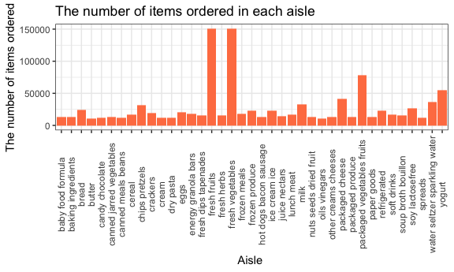

p8105\_hw3\_yl4358
================
YI LIU
10/6/2019

# Problem 1

``` r
library(p8105.datasets)
data("instacart")
```

  - The `instacart` dataset contains 1384617 rows and 15 columns; Key
    variables include `user_id`, `product_name`, `order_number`,
    `order_dow`, `order_hour_of_day` and so on. Every observation
    illustrates the product name, its order time, user’s relevant
    ordering information, its belonging aisle and department.

<!-- end list -->

``` r
instacart_1 =
  instacart %>%
  group_by(aisle) %>% 
  summarize(n = n()) %>% 
  arrange(desc(n))

head(instacart_1,10) %>% 
knitr::kable()
```

| aisle                         |      n |
| :---------------------------- | -----: |
| fresh vegetables              | 150609 |
| fresh fruits                  | 150473 |
| packaged vegetables fruits    |  78493 |
| yogurt                        |  55240 |
| packaged cheese               |  41699 |
| water seltzer sparkling water |  36617 |
| milk                          |  32644 |
| chips pretzels                |  31269 |
| soy lactosefree               |  26240 |
| bread                         |  23635 |

  - There are 134 aisles there and `fresh vegetables` and `fresh fruits`
    aisles are the most items ordered from.

<!-- end list -->

``` r
instacart_2 =
  instacart %>%
  group_by(aisle_id) %>% 
  summarize(n = n()) %>%
  arrange(desc(n)) %>% 
  filter(n >= 10000) %>% 
   ggplot(aes(x = aisle_id, y = n)) + 
    geom_point(color = "blue", size = 3) + geom_line(color = "blue") +
  labs(
    title = "The number of items ordered in each aisle",
    x = "Aisle ID",
    y = "The number of items ordered"
  ) +
  theme_bw()
instacart_2
```



  - We use point and line plot to display the number of items ordered in
    each aisle, they are quite different among aisles. As we can see,
    aisle 24 (fresh fruits) and aisle 83 (fresh vegetables) are aisles
    most items ordered from. Plot is so clear and straightforward that
    we could get information from it.

<!-- end list -->

``` r
instacart_3 =
  instacart %>% 
  filter(aisle == "baking ingredients" | aisle == "dog food care" | aisle == "packaged vegetables fruits") %>% 
  group_by(aisle, product_name) %>% 
  summarize(n = n()) %>% 
  filter(min_rank(desc(n)) == 1) %>% 
  rename(most_popular_items = product_name, ordering_counts = n) %>% 
  knitr::kable()
instacart_3
```

| aisle                      | most\_popular\_items                          | ordering\_counts |
| :------------------------- | :-------------------------------------------- | ---------------: |
| baking ingredients         | Light Brown Sugar                             |              499 |
| dog food care              | Snack Sticks Chicken & Rice Recipe Dog Treats |               30 |
| packaged vegetables fruits | Organic Baby Spinach                          |             9784 |

  - Concluded from the table, most popular items in `baking ingredient`,
    `dog food care` and `packaged vegetables fruits` aisle are
    respectively `light brown sugar`, `snack sticks chicken & rice
    recipe dog treats` and `organic baby spinach`.

<!-- end list -->

``` r
instacart_4 = 
  instacart %>% 
  filter(product_name == "Pink Lady Apples" | product_name == "Coffee Ice Cream") %>% 
  group_by(product_name, order_dow) %>% 
  summarize(
    mean_hour_of_the_day = round(mean(order_hour_of_day), digits = 1)
  ) %>% 
  pivot_wider(
    names_from = "order_dow",
    values_from = "mean_hour_of_the_day"
  ) %>%
  rename( Monday = '0', Tuesday = '1', Wednesday = '2', Thursday = '3', Friday = '4', Saturday = '5', Sunday = '6') %>% 
  knitr::kable()

instacart_4
```

| product\_name    | Monday | Tuesday | Wednesday | Thursday | Friday | Saturday | Sunday |
| :--------------- | -----: | ------: | --------: | -------: | -----: | -------: | -----: |
| Coffee Ice Cream |   13.8 |    14.3 |      15.4 |     15.3 |   15.2 |     12.3 |   13.8 |
| Pink Lady Apples |   13.4 |    11.4 |      11.7 |     14.2 |   11.6 |     12.8 |   11.9 |

  - People are more likely to order `Coffee Ice Cream` during
    12:00pm-15:00pm which is teatime and order `Pink Lady Apples` during
    11:00am to 14:00 pm when having lunch.

# Problem 2

``` r
library(p8105.datasets)
data("brfss_smart2010")

brfss_smart2010 = 
  brfss_smart2010 %>% 
  janitor::clean_names() %>% 
  filter(topic == "Overall Health" ) %>% 
  filter(response == "Excellent" | response == "Very good" | response == "Good" | response == "Fair" | response == "Poor") %>% 
  mutate(
    response = factor(response, levels = c("Poor", "Fair", "Good", "Very good", "Excellent"))
  )
```

``` r
states_grt7_2002 =
  brfss_smart2010 %>% 
  filter(year == 2002) %>% 
  group_by(locationabbr) %>% 
  summarize(
    n_unique = n_distinct(locationdesc)
  ) %>% 
  filter(n_unique >= 7) %>% 
  rename(state = locationabbr, number_of_locations = n_unique) %>% 
  knitr::kable()

states_grt7_2002
```

| state | number\_of\_locations |
| :---- | --------------------: |
| CT    |                     7 |
| FL    |                     7 |
| MA    |                     8 |
| NC    |                     7 |
| NJ    |                     8 |
| PA    |                    10 |

``` r
states_grt7_2010 =
  brfss_smart2010 %>% 
  filter(year == 2010) %>% 
  group_by(locationabbr) %>% 
  summarize(
    n_unique = n_distinct(locationdesc)
  ) %>% 
  filter(n_unique >= 7) %>% 
  rename(state = locationabbr, number_of_locations = n_unique) %>% 
  knitr::kable()

states_grt7_2010
```

| state | number\_of\_locations |
| :---- | --------------------: |
| CA    |                    12 |
| CO    |                     7 |
| FL    |                    41 |
| MA    |                     9 |
| MD    |                    12 |
| NC    |                    12 |
| NE    |                    10 |
| NJ    |                    19 |
| NY    |                     9 |
| OH    |                     8 |
| PA    |                     7 |
| SC    |                     7 |
| TX    |                    16 |
| WA    |                    10 |

  - In 2002, `CT`, `FL`, `MA`, `NC`, `NJ` and `PA` were observed at 7 or
    more locations; In 2010, `CA`, `CO`, `FL`, `MA`, `MD`, `NE`, `NJ`,
    `NY`, `OH`, `PA`, `SC`, `TX`, `WA` and `NC` were observed at 7 or
    more locations.

<!-- end list -->

``` r
excellent_df = 
  brfss_smart2010 %>% 
  filter(response == "Excellent") %>% 
  select(year, locationabbr, locationdesc, data_value) %>% 
  group_by(year, locationabbr) %>% 
  summarize(
    average_value = mean(data_value)
  ) %>% 
  rename(state = locationabbr)

excellent_df %>% 
  ungroup() %>% 
  group_by(state) %>% 
  ggplot(aes(x = year, y = average_value, color = state)) + 
  geom_line() +
  labs(
    title = "Average value over time within a state",
    x = "Year",
    y = "Average data value"
  ) +
  theme_bw() 
```

    ## Warning: Removed 3 rows containing missing values (geom_path).


  - The average data values vary greatly among different states.
